# Quotation PDF Generator — System & Developer Documentation

> **Document Type:** Formal Technical Documentation
> **Audience:** Developers, Maintainers, DevOps Engineers, Future Contributors
> **Scope:** Introduction, System Overview, Technology Stack, Google Drive Integration, Database Documentation
> **Version:** 1.0
> **Last Updated:** June 2026

---

## Table of Contents

1. [Introduction](#1-introduction)
2. [System Overview](#2-system-overview)
3. [Technology Stack](#3-technology-stack)
4. [Google Drive Integration Documentation](#4-google-drive-integration-documentation)
5. [Database Documentation](#5-database-documentation)

---

# 1. Introduction

## 1.1 Project Purpose

The **Quotation PDF Generator** is an internal business application built for **Super HR Co., Ltd.** to automate the creation, management, and archival of bilingual (English/Thai) quotation documents. The system replaces a manual, document-by-document workflow with a structured, auditable web application that produces print-ready PDF quotations, stores them in Google Drive, and maintains a historical record of every quotation issued.

At its core, the system answers a single business question: *"How can a sales representative produce a compliant, branded, bilingual quotation PDF for a prospective customer in under sixty seconds, with no manual layout work?"*

## 1.2 Business Objective

The system exists to satisfy the following business objectives:

| # | Objective | Implementation Outcome |
|---|-----------|------------------------|
| O1 | Reduce quotation turnaround time from hours to seconds | Templated PDF generation through `@react-pdf/renderer` |
| O2 | Guarantee brand and layout consistency across all quotations | Centralised PDF template (`backend/src/features/pdf/templates/quotation-pdf.tsx`) |
| O3 | Maintain immutable historical records | `supplierSnapshot` JSONB column on `quotations` table |
| O4 | Centralise PDF storage with shareable links | Google Drive integration with metadata persistence |
| O5 | Enforce tax-compliant document numbering | `QUOYYYYMMNNN` numbering scheme with validation rules |
| O6 | Support bilingual commerce in the Thai market | Sarabun font family, dual-language labels and item descriptions |
| O7 | Provide role-based access for administrative functions | JWT authentication with `USER`/`ADMIN` role column |

## 1.3 Main System Capabilities

The system provides the following functional capabilities:

1. **User Account Management** — Registration, authentication (JWT, 7-day expiry), profile management, signature image upload, password change.
2. **Supplier Information Management** — Singleton configuration record for the issuing company (Super HR), used to populate PDF header data.
3. **Package Catalogue Management** — CRUD for the four predefined pricing tiers (Starter, Basic Account, Advanced, Go Pro), each with monthly and yearly pricing.
4. **Special Offers Catalogue Management** — CRUD for promotional offers that can be attached to individual quotations.
5. **Quotation Lifecycle** — Create, read, update, delete, and duplicate quotations with full financial recalculation (package amount, add-ons, discount, VAT 7%, total).
6. **PDF Generation** — Server-side rendering of branded A4 quotation documents with embedded Sarabun fonts, company logo, signature image, and bilingual content.
7. **Cloud Storage Integration** — Automatic upload, update, and deletion of generated PDFs in Google Drive, with file ID and web view link persisted to the database.
8. **Search and Filtering** — Full pagination, customer/quotation-number search, and date-range filtering of the quotation list.
9. **API Documentation** — Interactive Swagger UI exposed at `/api/docs` for all REST endpoints.

## 1.4 Target Users

| User Role | Description | Primary Use Cases |
|-----------|-------------|-------------------|
| **Sales Representative** | Authenticated user with `USER` role | Creates, edits, previews, and shares quotations; manages own signature image |
| **Administrator** | Authenticated user with `ADMIN` role | All sales representative capabilities plus supplier info management, package/offer catalogue management |
| **Maintainer / Developer** | Off-platform user | Reads documentation, monitors deployment, runs migrations |
| **DevOps Engineer** | Off-platform user | Manages Render, Vercel, Neon, and Google Cloud Console configurations |

## 1.5 Scope of the System

### In Scope

- Web-based quotation CRUD operations
- Bilingual PDF generation with Sarabun (Thai) and Inter (Latin) typography
- Google Drive integration for cloud storage of generated PDFs
- JWT-based stateless authentication
- Singleton supplier information management with snapshot-based immutability
- Catalogue management for packages and special offers
- REST API with full Swagger/OpenAPI documentation
- Single-tenant deployment (one issuing company per installation)

### Out of Scope

- Multi-tenant SaaS operations
- Customer-facing self-service portal
- Email delivery of quotations
- Electronic signature workflows
- Payment processing or invoicing
- CRM integration or lead management
- Approval workflows beyond single-user authoring
- Mobile-native applications (responsive web only)

## 1.6 Key Features

### 1.6.1 Bilingual PDF Generation

The PDF rendering pipeline (`backend/src/features/pdf/pdf.service.tsx`) uses `@react-pdf/renderer` to compose an A4 document from a React component tree. Thai language rendering is supported through registration of the Sarabun font family (Regular, Bold, Italic, BoldItalic). The company logo (`superhr.png`) is embedded as a base64 data URL.

### 1.6.2 Immutable Supplier Snapshots

Each quotation captures a JSONB snapshot of the supplier information at creation/update time (`Quotation.supplierSnapshot`). This ensures that historical quotations remain reproducible even if the supplier record is later edited. See `backend/src/features/quotation/quotation.service.ts:355-363` and `:461-469`.

### 1.6.3 Server-Side Financial Recalculation

All financial fields (`packageAmount`, `addonsAmount`, `discount`, `subtotal`, `vatAmount`, `totalAmount`) are recomputed server-side in `QuotationService.recalculateFinances()` (`backend/src/features/quotation/quotation.service.ts:28-39`) regardless of values submitted by the client. This prevents client-side tampering with totals.

### 1.6.4 Quotation Number Validation

Manual quotation number overrides are validated against four rules in `QuotationService.validateQuotationNumber()` (`backend/src/features/quotation/quotation.service.ts:118-173`):

1. Format: must match `^QUO\d{4}(0[1-9]|1[0-2])\d{3}$`
2. Uniqueness across the table
3. The quotation month cannot be in the future
4. Soft warning if the sequence number regresses

### 1.6.5 Resilient Google Drive Integration

The `GoogleDriveService` (`backend/src/integrations/google-drive/google-drive.service.ts`) implements:

- Automatic 401 → token refresh
- Retry with backoff (`1s`, `3s`, `5s`) on `403`, `429`, `500`, `503`
- Graceful degradation when credentials are unconfigured
- Update-on-name-collision semantics (prevents duplicate files)

### 1.6.6 Cascading Quotation Duplication

The `/api/quotations/:id/duplicate` endpoint (`quotation.service.ts:666-722`) deep-copies a quotation including all items and offer records, regenerates the quotation number, and resets the version counter to 1.

## 1.7 System Limitations

| Limitation | Impact | Mitigation Strategy |
|------------|--------|---------------------|
| Signature images stored on local filesystem (`./uploads/signatures/`) | Lost on Render redeploy | Migrate to S3/Cloudflare R2 or persist as base64 |
| Single-instance backend on Render free tier | Cold starts of ~30 s after idle | Upgrade to paid tier or schedule uptime pings |
| Synchronous PDF generation blocks the event loop | Request queuing under load | Move to BullMQ background worker |
| No automated test suite | Regression risk on every change | Add Jest unit tests for services and Playwright E2E for critical paths |
| No rate limiting on auth endpoints | Brute-force exposure on `/api/auth/login` | Add `@nestjs/throttler` |
| Single-tenant only | Cannot serve multiple issuing companies | Introduce `tenantId` column and row-level scoping |
| JWT stored in `localStorage` | XSS exposure | Consider `httpOnly` cookie strategy if threat model warrants |

## 1.8 Assumptions and Dependencies

### Assumptions

- A single Google Cloud project exists with Drive API enabled and a refresh token pre-provisioned for the application's service account or delegated user.
- The issuing company has exactly one brand identity (one logo, one supplier record).
- All end-users have a modern browser with JavaScript enabled.
- Network connectivity to Google Drive API is reliable; transient failures are handled by the retry layer.
- The Thai fiscal year follows the Gregorian calendar for quotation numbering (year prefix uses Gregorian year, not Buddhist Era).
- VAT rate is fixed at 7% (Thai standard rate); adjustments require code change in `recalculateFinances()`.

### External Dependencies

| Dependency | Purpose | Failure Mode |
|------------|---------|--------------|
| Google Drive API | PDF storage and sharing | Quotation still saves locally; `driveFileId` is `null` |
| Neon PostgreSQL | Primary data store | Application cannot boot (`validateEnv()` exits) |
| Render | Backend hosting | Cold starts; ephemeral filesystem |
| Vercel | Frontend hosting | Build failures if env vars missing |
| Let's Encrypt / Platform SSL | HTTPS termination | Provided by hosting platforms |

### Internal Dependencies

- Prisma Client generated from `schema.prisma` must be regenerated whenever the schema changes.
- Sarabun `.ttf` files must be present in `backend/src/features/pdf/fonts/` and copied by `nest-cli.json` `assets` configuration to `dist/`.
- The seed script (`backend/prisma/seed.ts`) must be executed once after initial migration.

## 1.9 High-Level Workflow Summary

The end-to-end quotation generation workflow proceeds as follows:

1. **Authentication** — User logs in via `/login`; backend issues a JWT stored in browser `localStorage`.
2. **Catalogue Preparation** — (Administrator) Configures supplier info, packages, and special offers via `/settings/*`.
3. **Quotation Initiation** — User clicks "New Quotation"; the system pre-fetches the next quotation number from `GET /api/quotations/next-number`.
4. **Customer & Package Selection** — User enters customer details (with 13-digit Thai Tax ID validation), selects a package, and toggles billing type (Monthly/Yearly).
5. **Itemisation** — Package line item is auto-populated; user adds zero or more add-on line items.
6. **Special Offers** — User selects from the active offers catalogue.
7. **Signature Upload** — User uploads an authorised signature image (PNG/JPEG, ≤ 2 MB).
8. **Submission** — Frontend submits a `POST /api/quotations` request with the full DTO.
9. **Server-Side Processing** — Backend validates, recalculates finances, captures supplier snapshot, persists quotation + items + offers in a single transaction.
10. **PDF Generation** — `PdfService.generateQuotationPdf()` renders the React-PDF document to a `Buffer`.
11. **Cloud Upload** — `GoogleDriveService.uploadFile()` uploads the buffer to the configured Drive folder; `driveFileId`, `driveUrl`, and `pdfFileSize` are written back to the quotation row.
12. **Persistence** — Quotation record is updated with Drive metadata and returned to the client.
13. **Consumption** — User can preview the PDF in-browser (`/quotations/:id/preview`), download it (`/api/quotations/:id/download`), or open the Drive link.

---

# 2. System Overview

## 2.1 Overall Workflow

The system follows a classical three-tier architecture with a React-based presentation layer, a NestJS application layer, and a PostgreSQL data layer augmented by the Google Drive storage service.

The diagram below summarises the complete path from user login through to PDF generation and cloud storage.

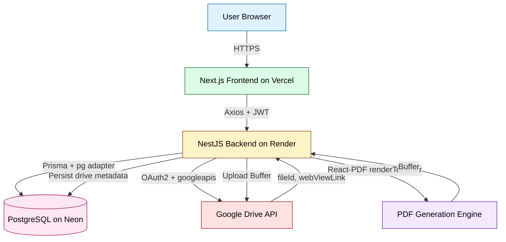

## 2.2 Frontend Responsibilities

The frontend (`frontend/src/`) is a Next.js 16 application using the App Router. Its responsibilities are:

| Responsibility | Implementation Location |
|----------------|--------------------------|
| Public/private route separation | `src/app/(auth)/` and `src/app/(dashboard)/` route groups |
| Authentication state management | `src/hooks/use-auth.ts` (React Query) |
| API client configuration | `src/lib/api.ts` (Axios instance + interceptors) |
| JWT attachment to requests | Axios request interceptor (`src/lib/api.ts:10-18`) |
| 401 handling and redirect | Axios response interceptor (`src/lib/api.ts:20-29`) |
| Server-state caching | `src/lib/query-provider.tsx` (TanStack React Query) |
| Quotation list, search, pagination | `src/app/(dashboard)/quotations/page.tsx` |
| Quotation create/edit forms | `src/app/(dashboard)/quotations/create/page.tsx` and `[…/edit]` |
| Quotation preview | `src/app/(dashboard)/quotations/[id]/preview/page.tsx` |
| Settings pages (supplier, packages, offers) | `src/app/(dashboard)/settings/*/page.tsx` |
| Bilingual UI text | Hardcoded in components |
| Signature image upload | `src/lib/api.ts:uploadSignature()` |
| Toast notifications | `sonner` via `src/components/ui/sonner.tsx` |
| Design system primitives | `src/components/ui/*` (shadcn/ui + @base-ui/react) |

The frontend holds no global client-side store; all server state lives in React Query's cache, and all UI state is component-local via `useState`/`useEffect`.

## 2.3 Backend Responsibilities

The backend (`backend/src/`) is a NestJS 11 application exposing a `/api`-prefixed REST API. Its responsibilities are:

| Responsibility | Implementation Location |
|----------------|--------------------------|
| HTTP entrypoint and validation pipe | `src/main.ts:16-56` |
| Module composition | `src/app.module.ts:18-42` |
| Configuration loading | `src/config/configuration.ts` |
| Prisma client lifecycle | `src/prisma/prisma.service.ts` |
| JWT authentication | `src/features/auth/` + `src/common/guards/jwt-auth.guard.ts` |
| Role-based authorisation (decorator ready) | `src/common/guards/roles.guard.ts` + `src/common/decorators/roles.decorator.ts` |
| Quotation business logic | `src/features/quotation/quotation.service.ts` |
| PDF generation | `src/features/pdf/pdf.service.tsx` |
| Google Drive integration | `src/integrations/google-drive/google-drive.service.ts` |
| Static file serving (signatures) | `ServeStaticModule` in `app.module.ts:26-29` |
| Swagger/OpenAPI docs | `src/main.ts:39-46` (mounted at `/api/docs`) |
| Global exception filter | `src/common/filters/http-exception.filter.ts` |
| Health check | `src/app.controller.ts` (`GET /api/health`) |
| Request validation | `ValidationPipe` with `whitelist`, `forbidNonWhitelisted`, `transform` (`src/main.ts:26-32`) |

## 2.4 Database Responsibilities

The PostgreSQL database (hosted on Neon in production) acts as the single source of truth for all persistent state:

- **Identity**: `users` table with bcrypt-hashed passwords and signature URLs.
- **Catalogue**: `packages` and `special_offers` tables for the product/offer catalogue.
- **Configuration**: `supplier_info` (singleton) and `google_drive_settings` (singleton) tables.
- **Transactional**: `quotations`, `quotation_items`, `quotation_special_offers` tables for the core business record.
- **Immutability**: `Quotation.supplierSnapshot` JSONB column captures point-in-time supplier data.

The ORM layer (Prisma 7.8) generates a TypeScript client into `backend/src/generated/prisma/`, exposing strongly-typed query builders per model.

## 2.5 PDF Generation Responsibilities

The PDF subsystem (`backend/src/features/pdf/`) is responsible for:

1. **Font Registration** — Registers the Sarabun family (Regular, Bold, Italic, BoldItalic) at module load time via `Font.register()` (`pdf.service.tsx:22-30`).
2. **Logo Embedding** — Reads `assets/superhr.png` from disk, encodes to base64, and passes as the `logoSrc` prop to the document component (`pdf.service.tsx:32-35`).
3. **Asset Path Resolution** — Normalises the asset directory between development (`src/`) and production (`dist/`) layouts (`pdf.service.tsx:16-19`).
4. **Document Rendering** — Invokes `renderToBuffer(<QuotationPdfDocument ... />)` and returns the binary buffer (`pdf.service.tsx:41-48`).
5. **Template Composition** — The React-PDF document component (`templates/quotation-pdf.tsx`) renders the A4 layout with header, supplier/customer/document info, hero banner, itemisation table, special offers, payment terms, financial summary, and signature footer.

## 2.6 Google Drive Integration Responsibilities

The Google Drive subsystem (`backend/src/integrations/google-drive/`) is responsible for:

1. **OAuth2 client configuration** at service construction time using `clientId`, `clientSecret`, and `refreshToken` from environment variables (`google-drive.service.ts:22-51`).
2. **File upload** with automatic deduplication by filename within the target folder (`google-drive.service.ts:89-138`).
3. **File update** by file ID for existing PDF revisions (`google-drive.service.ts:156-190`).
4. **File deletion** by file ID, invoked when a quotation is deleted (`google-drive.service.ts:192-203`).
5. **Folder validation** to confirm a folder ID resolves to an actual Drive folder (`google-drive.service.ts:205-227`).
6. **Connection testing** via `drive.about.get()` (`google-drive.service.ts:229-244`).
7. **Retry and refresh** logic centralised in `withRetry()` (`google-drive.service.ts:57-87`).

## 2.7 Authentication Flow

The system uses stateless JWT authentication with the following end-to-end flow:

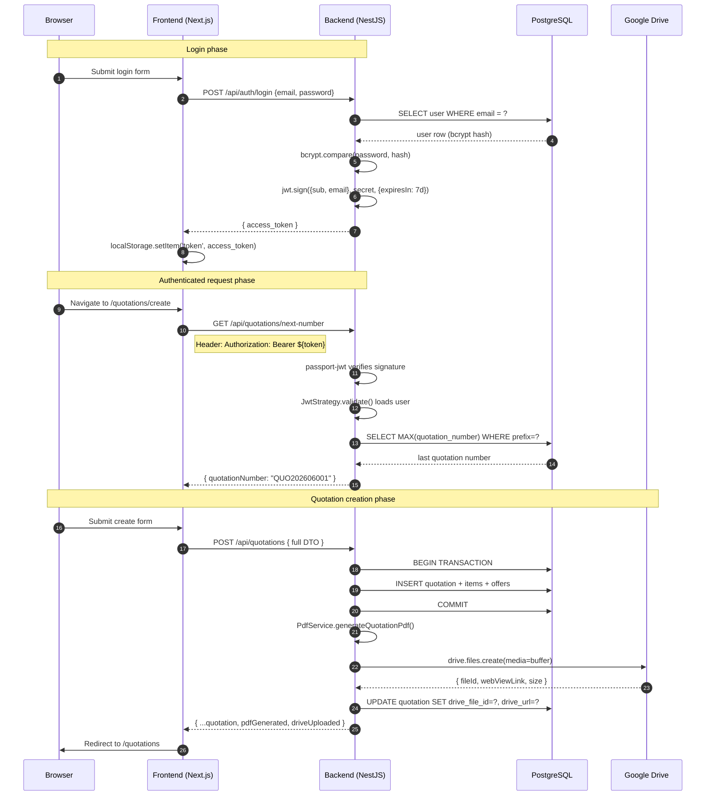

## 2.8 File Storage Flow

Two distinct file storage flows exist in the system:

### 2.8.1 Signature Images (Local Filesystem)

```mermaid
flowchart LR
    A[User selects PNG/JPEG] -->|FormData| B[POST /api/quotations/upload-signature]
    B -->|multer diskStorage| C[(./uploads/signatures/)]
    C -->|URL path| D[/uploads/signatures/file.png]
    D -->|UPDATE users SET signature_url| E[(PostgreSQL)]
    D -->|ServeStaticModule| F[Publicly served via /uploads/*]
```

Signature images are stored on the backend's local filesystem under `./uploads/signatures/`. The `ServeStaticModule` (configured in `app.module.ts:26-29`) exposes this directory at the `/uploads` HTTP path. The stored URL (`/uploads/signatures/<file>`) is persisted to `users.signatureUrl` and embedded into PDFs at render time. The PDF service resolves this URL to a base64 data URL before passing it to the renderer (`quotation.service.ts:179-190`).

> **Note:** See `SYSTEM_MANUAL.md` §11 for the known limitation that this approach is non-durable on Render's ephemeral filesystem.

### 2.8.2 Generated PDFs (Google Drive)

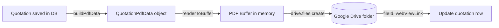

PDFs are never persisted to the local filesystem. They are generated into an in-memory `Buffer` and uploaded directly to Google Drive. The Drive `fileId`, `webViewLink`, and file size are persisted back to the `quotations` row.

## 2.9 Data Flow Between Components

### 2.9.1 Component Interaction Diagram

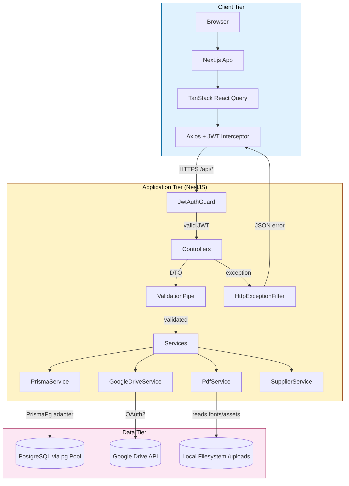

### 2.9.2 High-Level Workflow Diagram

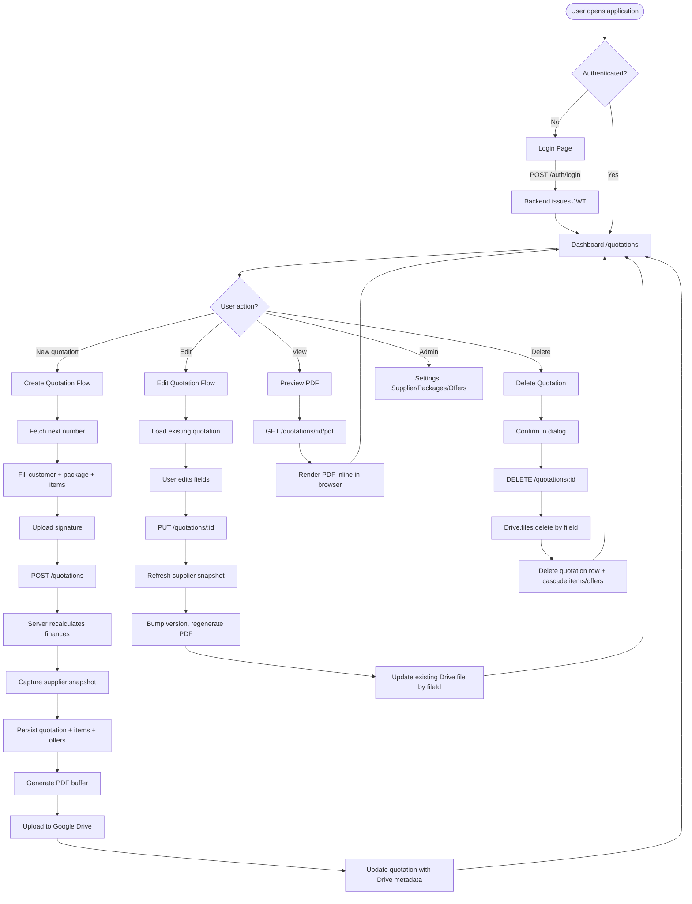

### 2.9.3 Diagram Explanations

**System Context Diagram (§2.1)**

The system has four external actors: the user browser (initiator of all actions), the Next.js frontend (presentation and API client), the NestJS backend (business logic and PDF engine), and three external services (Neon PostgreSQL, Google Drive API, and the in-process PDF generation engine). All inter-tier communication is HTTPS with JSON payloads, except for PDF streaming responses which use `application/pdf` content type with `Content-Disposition` headers.

**High-Level Workflow Diagram (§2.9.2)**

This diagram captures every meaningful state transition reachable from the dashboard. Notable branches: the create flow performs nine discrete steps including supplier snapshot capture and Drive upload; the edit flow bumps `version` and updates the existing Drive file by `fileId`; the delete flow performs Drive deletion *before* database deletion to ensure orphaned Drive files cannot accumulate.

**Component Interaction Diagram (§2.9.1)**

Three tiers are visible. Within the application tier, every request passes through `JwtAuthGuard` → `ValidationPipe` → `Controller` → `Service` → one or more data-access components. Exceptions propagate back through `HttpExceptionFilter` which normalises the response shape to `{ statusCode, message, timestamp }`. The `PdfService` and `GoogleDriveService` are stateless and depend only on their constructor-injected configuration.

---

# 3. Technology Stack

This chapter documents every technology choice in the codebase, categorised by layer. Each entry includes the technology's purpose within this project, the rationale for its selection, and the location where it is configured or consumed.

## 3.1 Frontend

### 3.1.1 Framework and Core Libraries

| Technology | Version | Purpose | Why It Is Used |
|------------|---------|---------|----------------|
| **Next.js** | 16.2.7 | React meta-framework providing App Router, file-based routing, SSR/CSR | First-class React 19 support, zero-config Vercel deployment, route groups for auth gating |
| **React** | 19.2.4 | UI component runtime | Industry standard; required by Next.js 16 and `@react-pdf/renderer` peer |
| **TypeScript** | ^5.x | Static type checking | Catches type errors at build time; required for typed hooks and DTOs |
| **TanStack React Query** | ^5.101.0 | Server-state cache and synchronisation | Replaces global state stores; provides `useQuery`/`useMutation` with automatic refetch, retry, and cache invalidation |
| **Axios** | ^1.17.0 | HTTP client | Interceptor API enables centralised JWT attachment and 401 handling (`frontend/src/lib/api.ts`) |
| **react-hook-form** | ^7.77.0 | Form state management (used selectively) | Performant controlled inputs with minimal re-renders |
| **@hookform/resolvers** | ^5.4.0 | Schema resolvers for react-hook-form | Bridges Zod schemas to react-hook-form |
| **Zod** | ^4.4.3 | Schema validation | Runtime type-safe parsing of form inputs |
| **date-fns** | ^4.4.0 | Date utilities | Lightweight alternative to moment.js for date arithmetic in the create form |

### 3.1.2 UI and Styling

| Technology | Version | Purpose | Why It Is Used |
|------------|---------|---------|----------------|
| **Tailwind CSS** | v4 | Utility-first CSS framework | Atomic styling with JIT compilation; design tokens via CSS variables |
| **@tailwindcss/postcss** | ^4 | PostCSS integration for Tailwind v4 | Required pipeline plugin for v4 |
| **shadcn/ui** | ^4.10.0 | Copy-paste component primitives | Not a runtime dependency; provides source for `components/ui/*` primitives |
| **@base-ui/react** | ^1.5.0 | Unstyled accessible primitives | Underpins shadcn components with WAI-ARIA compliance |
| **Radix UI** (via shadcn) | — | Headless component patterns | Accessible dialog, select, switch primitives |
| **lucide-react** | ^1.17.0 | SVG icon set | Consistent line-icon style; tree-shakeable |
| **class-variance-authority** | ^0.7.1 | Component variant authoring | Type-safe variant composition for buttons, badges |
| **clsx** | ^2.1.1 | Conditional className concatenation | Tiny utility used in `cn()` helper (`src/lib/utils.ts`) |
| **tailwind-merge** | ^3.6.0 | Tailwind class conflict resolution | Prevents `p-2 p-4` style conflicts when composing classes |
| **tw-animate-css** | ^1.4.0 | Animation utilities | Tailwind plugin for declarative animations |
| **next-themes** | ^0.4.6 | Dark mode provider | Theme switching without rehydration flicker |
| **sonner** | ^2.0.7 | Toast notification system | Used in `components/ui/sonner.tsx`; triggered from mutation hooks |

### 3.1.3 Data Fetching and Forms

| Concern | Technology | Configuration Location |
|---------|------------|------------------------|
| Base URL resolution | `process.env.NEXT_PUBLIC_API_URL` | `frontend/src/lib/api.ts:3` |
| JWT attachment | Axios request interceptor | `frontend/src/lib/api.ts:10-18` |
| 401 redirect | Axios response interceptor | `frontend/src/lib/api.ts:20-29` |
| Query cache config | `staleTime: 60s`, `retry: 1` | `frontend/src/lib/query-provider.tsx:11-14` |
| File uploads | `uploadSignature()` helper | `frontend/src/lib/api.ts:31-38` |

### 3.1.4 Styling Strategy

Tailwind v4 with PostCSS plugin. Design tokens are defined as CSS variables in `frontend/src/app/globals.css`. Components compose classes via the `cn()` utility (`src/lib/utils.ts`). No CSS-in-JS runtime is used.

## 3.2 Backend

### 3.2.1 Framework and Runtime

| Technology | Version | Purpose | Why It Is Used |
|------------|---------|---------|----------------|
| **NestJS** | ^11.0.1 | Modular Node.js framework | Opinionated module/controller/service pattern; first-class DI, Passport integration, OpenAPI support |
| **Passport** | ^0.7.0 | Authentication middleware | Strategy-based auth; integrates with `passport-jwt` |
| **@nestjs/passport** | ^11.0.5 | NestJS Passport bindings | Wraps Passport in injectable guards |
| **passport-jwt** | ^4.0.1 | JWT extraction/verification strategy | Extracts JWT from `Authorization: Bearer` header |
| **@nestjs/jwt** | ^11.0.2 | JWT signing service | Signs tokens with HS256 + 7-day expiry |
| **@nestjs/config** | ^4.0.4 | Typed environment configuration | `ConfigModule.forRoot({ isGlobal: true })` in `app.module.ts:20-24` |
| **@nestjs/swagger** | ^11.4.4 | OpenAPI generation | Decorators drive auto-generated docs at `/api/docs` |
| **@nestjs/serve-static** | ^5.0.5 | Static file serving | Serves `./uploads` at `/uploads` for signature images |
| **@nestjs/platform-express** | ^11.0.1 | Express adapter | Default HTTP platform for NestJS |
| **reflect-metadata** | ^0.2.2 | Metadata reflection polyfill | Required by NestJS decorators |
| **rxjs** | ^7.8.1 | Reactive primitives | Underlying NestJS observables |

### 3.2.2 Validation and Serialisation

| Technology | Version | Purpose | Why It Is Used |
|------------|---------|---------|----------------|
| **class-validator** | ^0.15.1 | Decorator-based DTO validation | Used on every DTO (e.g. `@IsString`, `@Matches(/^\d{13}$/)` for Thai Tax ID) |
| **class-transformer** | ^0.5.1 | DTO transformation | `@Type(() => Number)` for query params; powers `transform: true` in global pipe |

### 3.2.3 ORM and Database Access

| Technology | Version | Purpose | Why It Is Used |
|------------|---------|---------|----------------|
| **Prisma** | ^7.8.0 | Schema-first ORM | Type-safe query builder, migration tooling, schema as source of truth |
| **@prisma/client** | ^7.8.0 | Generated query client | Generated into `src/generated/prisma/` per `schema.prisma` |
| **@prisma/adapter-pg** | ^7.8.0 | Driver adapter for `pg` | Enables `PrismaPg` adapter pattern with connection pooling |
| **pg** | ^8.21.0 | PostgreSQL driver | Underlying connection pool with SSL auto-detection for Neon |

### 3.2.4 PDF and Document Generation

| Technology | Version | Purpose | Why It Is Used |
|------------|---------|---------|----------------|
| **@react-pdf/renderer** | ^4.5.1 | React-based PDF rendering | Allows PDF templates to be authored as JSX; supports Thai fonts and base64 image embedding |
| **React** (server-side) | ^19.2.7 | JSX runtime for PDF templates | Peer dependency of `@react-pdf/renderer` |

### 3.2.5 Authentication and Security

| Technology | Version | Purpose | Why It Is Used |
|------------|---------|---------|----------------|
| **bcryptjs** | ^3.0.3 | Password hashing | Pure-JS bcrypt; 10 rounds in `auth.service.ts:25` and `:121` |
| **googleapis** | ^173.0.0 | Google Drive API client | Official Node SDK; supports `drive.files.{create,update,delete,list,get}` |
| **multer** | ^2.1.1 | Multipart form parser | Used by `FileInterceptor` for signature uploads |

## 3.3 Infrastructure

### 3.3.1 Database

| Technology | Purpose | Configuration |
|------------|---------|---------------|
| **PostgreSQL 16+** | Primary relational data store | Connection string in `DATABASE_URL`; Neon in production, local Docker in development |
| **Neon** | Production Postgres hosting | Serverless Postgres with SSL (`sslmode=require`); auto-detected in `prisma.service.ts:14-16` |
| **pg.Pool** | Connection pooling | Created in `PrismaService` constructor (`prisma.service.ts:12-17`) |

### 3.3.2 Hosting Providers

| Layer | Provider | Configuration File |
|-------|----------|--------------------|
| Frontend | **Vercel** | Inferred from `frontend/` directory; root directory must be set to `frontend` |
| Backend | **Render** | `render.yaml` at repository root |
| Database | **Neon** | `DATABASE_URL` env var |
| OAuth provider | **Google Cloud Console** | Manual project setup; credentials in env vars |

### 3.3.3 Storage Services

| Service | Purpose | Auth Method |
|---------|---------|-------------|
| **Google Drive API** | PDF storage and sharing | OAuth2 with long-lived refresh token |
| **Local filesystem (`./uploads/signatures/`)** | Signature image storage | None (private filesystem, served via ServeStaticModule) |

### 3.3.4 Build Tools

| Tool | Purpose | Configuration |
|------|---------|---------------|
| **nest build** | TypeScript → `dist/` compilation | `nest-cli.json` with `assets: ["**/*.ttf", "**/*.png"]` for font/logo copying |
| **next build** | Frontend production build | `next.config.ts` (empty config — no `output: 'standalone'`) |
| **prisma generate** | Client generation | Triggered in `render.yaml` build command and `package.json` postinstall |
| **prisma migrate deploy** | Production migration runner | Triggered in `render.yaml` start command |
| **tsx** | TypeScript execution for seed script | `npx tsx prisma/seed.ts` in `prisma.config.ts` |
| **ts-node** | TypeScript execution (dev) | Available but `tsx` is preferred for seed |
| **tsconfig-paths** | Path alias resolution at runtime | Used by Jest and start scripts |

## 3.4 Development Tools

### 3.4.1 Package Managers and Version Control

| Tool | Purpose |
|------|---------|
| **npm** | Package manager (lockfile committed) |
| **Git** | Version control |
| **GitHub** | Repository hosting (inferred from deployment flow) |

### 3.4.2 TypeScript Configuration

The backend `tsconfig.json` enables strict mode with these notable flags:

| Flag | Value | Rationale |
|------|-------|-----------|
| `target` | `ES2023` | Modern Node.js support |
| `module` | `commonjs` | Required by NestJS runtime |
| `moduleResolution` | `node` | Classic Node resolution |
| `jsx` | `react-jsx` | Required for `.tsx` files in PDF templates |
| `experimentalDecorators` | `true` | NestJS decorator metadata |
| `emitDecoratorMetadata` | `true` | NestJS DI introspection |
| `strictNullChecks` | `true` | Null safety |
| `noImplicitAny` | `true` | Type safety |
| `skipLibCheck` | `true` | Build performance |
| `incremental` | `true` | Faster rebuilds via `.tsbuildinfo` |

### 3.4.3 Linting and Formatting

| Tool | Configuration File | Notes |
|------|--------------------|-------|
| **ESLint** | `backend/eslint.config.mjs`, `frontend/eslint.config.mjs` | Flat config format (ESLint 9) |
| **Prettier** | `backend/.prettierrc` | Configured; `npm run format` script wired in backend `package.json` |
| **eslint-config-prettier** | — | Disables conflicting ESLint style rules |
| **eslint-plugin-prettier** | — | Runs Prettier as ESLint rule |
| **typescript-eslint** | ^8.20.0 | TypeScript-aware linting |
| **eslint-config-next** | 16.2.7 | Next.js-specific rules |

### 3.4.4 Testing

| Tool | Purpose | Status |
|------|---------|--------|
| **Jest** | Unit testing framework | Configured in `backend/package.json`; no spec files yet beyond `app.controller.spec.ts` |
| **ts-jest** | TypeScript Jest transformer | Configured |
| **supertest** | HTTP integration testing | Available; no e2e specs written |
| **@nestjs/testing** | NestJS test module builder | Available |

## 3.5 Technology Interaction Summary

```mermaid
flowchart LR
    subgraph BrowserRuntime["Browser Runtime"]
        React[React 19]
        NextJS[Next.js 16 App Router]
        ReactQuery[TanStack Query]
        Axios[Axios]
        Tailwind[Tailwind v4]
    end

    subgraph NodeRuntime["Node.js Runtime"]
        NestJS[NestJS 11]
        Passport[Passport + JWT]
        ClassValidator[class-validator]
        Prisma[Prisma 7.8]
        PgAdapter[@prisma/adapter-pg]
        ReactPDF[@react-pdf/renderer]
        GoogleAPIs[googleapis]
        Multer[multer]
    end

    subgraph ExternalServices["External Services"]
        Postgres[(PostgreSQL on Neon)]
        Drive[(Google Drive)]
    end

    NextJS --> React
    NextJS --> ReactQuery
    ReactQuery --> Axios
    NextJS --> Tailwind

    Axios -->|HTTPS| NestJS
    NestJS --> Passport
    NestJS --> ClassValidator
    NestJS --> Prisma
    Prisma --> PgAdapter
    PgAdapter --> Postgres
    NestJS --> ReactPDF
    NestJS --> GoogleAPIs
    GoogleAPIs --> Drive
    NestJS --> Multer

    style BrowserRuntime fill:#e0f2fe,stroke:#0369a1,color:#000
    style NodeRuntime fill:#fef3c7,stroke:#92400e,color:#000
    style ExternalServices fill:#fce7f3,stroke:#9d174d,color:#000
```

**Key interaction notes:**

1. **Frontend ↔ Backend**: JSON over HTTPS with Bearer JWT authentication. The Axios interceptor in `frontend/src/lib/api.ts:10-18` is the single source of truth for header injection.
2. **Backend ↔ Database**: Prisma wraps `pg.Pool` via the `PrismaPg` driver adapter. SSL is auto-enabled when `DATABASE_URL` contains `neon.tech` (`prisma.service.ts:14-16`).
3. **Backend ↔ Google Drive**: The `googleapis` SDK uses an `OAuth2Client` initialised with a refresh token. Tokens refresh transparently on 401 responses.
4. **Backend ↔ PDF Engine**: `@react-pdf/renderer`'s `renderToBuffer()` consumes a React element and returns a Node `Buffer` without touching the filesystem.
5. **Backend ↔ Local Files**: Multer writes signature uploads to `./uploads/signatures/`; `ServeStaticModule` serves them at `/uploads/*`.

---

# 4. Google Drive Integration Documentation

## 4.1 Overview

### 4.1.1 Purpose

The Google Drive integration provides durable cloud storage for generated quotation PDFs. Every time a quotation is created, updated, or deleted, the corresponding Drive file is created, updated, or deleted in lockstep. The Drive folder acts as the canonical archive of issued quotations; the application database stores only the metadata (`fileId`, `webViewLink`, `size`) required to reference and manipulate the remote file.

### 4.1.2 Business Use Case

Sales teams need to:

- Share quotation PDFs with prospects via a stable URL
- Maintain a centralised, date-stamped archive of every quotation ever issued
- Replace historical quotation files in place when corrections are made
- Ensure that deleted quotations do not leave orphaned files in Drive

The integration satisfies all four needs while abstracting the Drive API surface behind a single NestJS service.

## 4.2 Architecture

### 4.2.1 Authentication Mechanism

The integration uses **OAuth2 with a long-lived refresh token**. The application never prompts an end-user for consent; an administrator performs a one-time OAuth flow out-of-band to obtain a refresh token, which is then loaded from environment variables at application startup.

The `OAuth2Client` (`google-auth-library`) is configured with `clientId` and `clientSecret`, then has its credentials populated from the refresh token:

```typescript
this.oauth2Client = new google.auth.OAuth2(clientId, clientSecret);
this.oauth2Client.setCredentials({ refresh_token: refreshToken });
```

(Source: `backend/src/integrations/google-drive/google-drive.service.ts:35-36`)

### 4.2.2 OAuth Flow (Out-of-Band Provisioning)

The refresh token is obtained through Google's OAuth2 installed-app flow, performed once by an administrator:

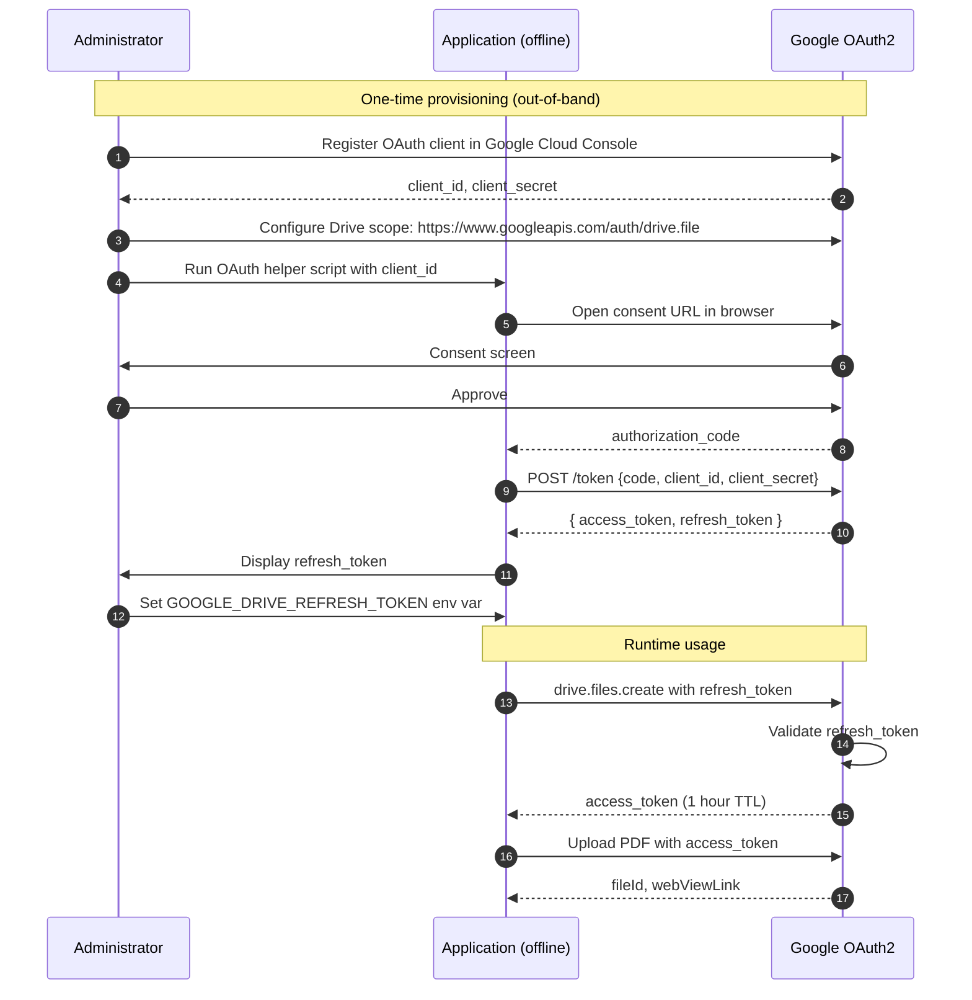

> **Scope selection:** The integration uses the `drive.file` scope (recommended) which restricts the application's access to only files it created. If broader access is required (e.g. organising pre-existing folders), the `drive` scope must be used and the consent screen may require verification.

### 4.2.3 Token Management

| Concern | Strategy |
|---------|----------|
| Access token lifetime | ~1 hour (Google default) |
| Refresh token lifetime | Effectively unlimited until revoked by user or admin |
| Refresh trigger | Automatic on first API call after process start (`setCredentials` populates from refresh token; SDK refreshes lazily) |
| Refresh invocation | `oauth2Client.getAccessToken()` in `withRetry()` on 401 (`google-drive.service.ts:67-72`) |
| Refresh failure | Throws `Google Drive auth refresh failed` error |

### 4.2.4 Refresh Token Process

The `google-auth-library` handles refresh internally. The application's responsibility is to detect 401 responses and trigger a refresh attempt. The retry wrapper (`withRetry()`) implements this:

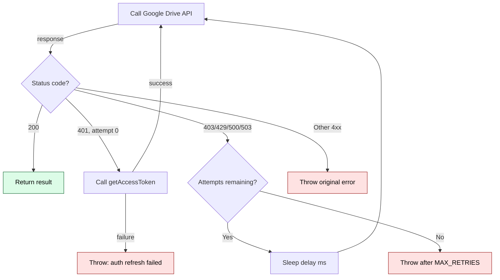

## 4.3 Configuration

### 4.3.1 Environment Variables

All Google Drive configuration is supplied via environment variables loaded by `@nestjs/config`:

| Variable | Required | Description | Example |
|----------|----------|-------------|---------|
| `GOOGLE_DRIVE_CLIENT_ID` | Yes | OAuth2 client ID from Google Cloud Console | `xxxxxxxxxxxx.apps.googleusercontent.com` |
| `GOOGLE_DRIVE_CLIENT_SECRET` | Yes | OAuth2 client secret | `GOCSPX-xxxxxxxxxxxx` |
| `GOOGLE_DRIVE_REFRESH_TOKEN` | Yes | Long-lived refresh token obtained via offline consent flow | `1//04xxxxxxxxxxxx` |
| `GOOGLE_DRIVE_FOLDER_ID` | Recommended | Target folder ID where PDFs will be uploaded. If omitted, files upload to Drive root | `19K_96rmBns2_J5361S_8cqPmePnUVKGe` |

### 4.3.2 Configuration Loading

Variables are loaded in `backend/src/config/configuration.ts:9-14`:

```typescript
googleDrive: {
  clientId: process.env.GOOGLE_DRIVE_CLIENT_ID,
  clientSecret: process.env.GOOGLE_DRIVE_CLIENT_SECRET,
  refreshToken: process.env.GOOGLE_DRIVE_REFRESH_TOKEN,
  folderId: process.env.GOOGLE_DRIVE_FOLDER_ID,
},
```

### 4.3.3 Graceful Degradation

If any of `clientId`, `clientSecret`, or `refreshToken` is missing, the service sets `this.enabled = false` and logs the missing variables (`google-drive.service.ts:42-50`). All public methods then return placeholder values instead of throwing, allowing quotation creation to succeed without Drive storage. This is a deliberate design choice: a missing Drive configuration should not block the core business flow.

### 4.3.4 Runtime Folder Override

The `google_drive_settings` table (managed by `GoogleDriveSettingsService`) stores an alternative folder URL/ID that can be edited at runtime via `/api/google-drive-settings`. However, the **active upload folder is determined by `GOOGLE_DRIVE_FOLDER_ID` env var**, not the database record. The database record is used by the `validate-folder` and `test-connection` endpoints to verify the persisted folder ID.

## 4.4 Services

### 4.4.1 GoogleDriveService

**Location:** `backend/src/integrations/google-drive/google-drive.service.ts`

**Module:** `GoogleDriveModule` (`google-drive.module.ts`) — provides and exports the service as a NestJS injectable.

**Public API:**

| Method | Signature | Returns | Description |
|--------|-----------|---------|-------------|
| `uploadFile` | `(fileName: string, buffer: Buffer, mimeType: string)` | `Promise<DriveFileResult>` | Uploads a new file, or updates an existing file if a file with the same name exists in the target folder |
| `updateFile` | `(fileId: string, buffer: Buffer, mimeType: string)` | `Promise<DriveFileResult>` | Replaces the content of an existing file by ID |
| `deleteFile` | `(fileId: string)` | `Promise<void>` | Permanently deletes a file by ID |
| `validateFolder` | `(folderId: string)` | `Promise<{ valid, error?, folderName? }>` | Verifies the folder ID resolves to an actual Drive folder |
| `testConnection` | `()` | `Promise<{ connected, error? }>` | Calls `drive.about.get()` to confirm OAuth2 credentials are valid |

**Result type:**

```typescript
export interface DriveFileResult {
  fileId: string;
  webViewLink: string;
  size: string;
}
```

### 4.4.2 Upload Process

The upload flow is the most complex operation. The sequence below is the canonical happy path; failure modes are described in §4.6.

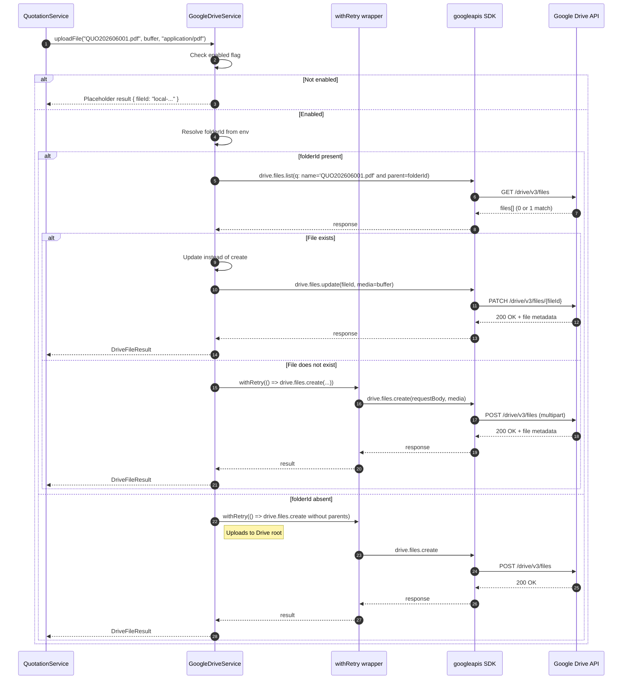

Key implementation details:

- **Deduplication lookup** (`findFileByName`, `google-drive.service.ts:140-154`) uses a `drive.files.list` query with `name = '<filename>' and '<folderId>' in parents and trashed = false`. Single quotes in filenames are escaped via backslash.
- **Stream conversion** — The buffer is wrapped in `stream.Readable.from(buffer)` (`google-drive.service.ts:124`) because the SDK's media body expects a Node `Readable` stream.
- **Fields projection** — `fields: 'id, webViewLink, size'` limits the response payload to only the metadata the application needs.

### 4.4.3 Update Process

The update flow is invoked when a quotation is edited (`QuotationService.updateDrivePdf()` at `quotation.service.ts:297-338`).

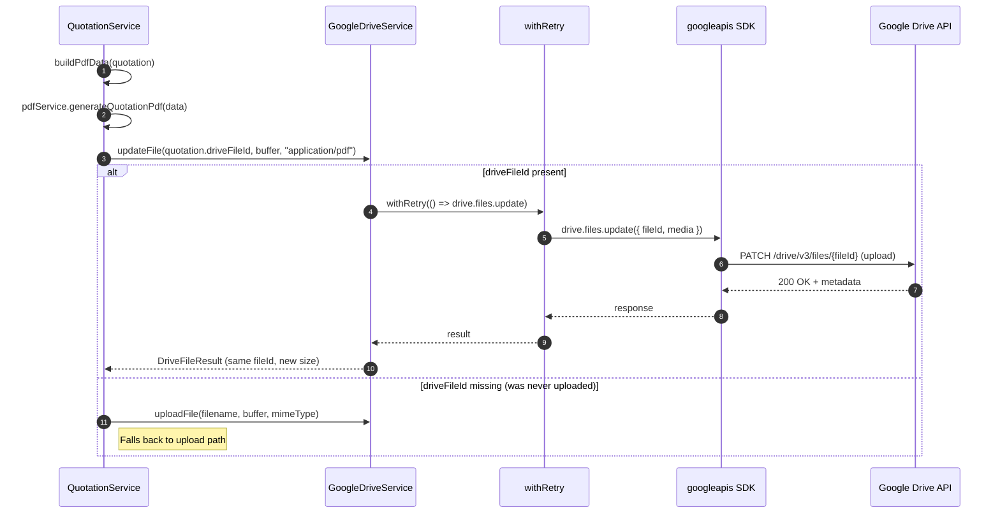

The update flow uses Drive's media-upload PATCH endpoint, which replaces the file's binary content while preserving the `fileId` and the existing Drive URL. This ensures previously shared Drive links continue to resolve to the latest revision.

### 4.4.4 Delete Process

The delete flow is invoked from `QuotationService.remove()` (`quotation.service.ts:648-664`) when a user deletes a quotation.

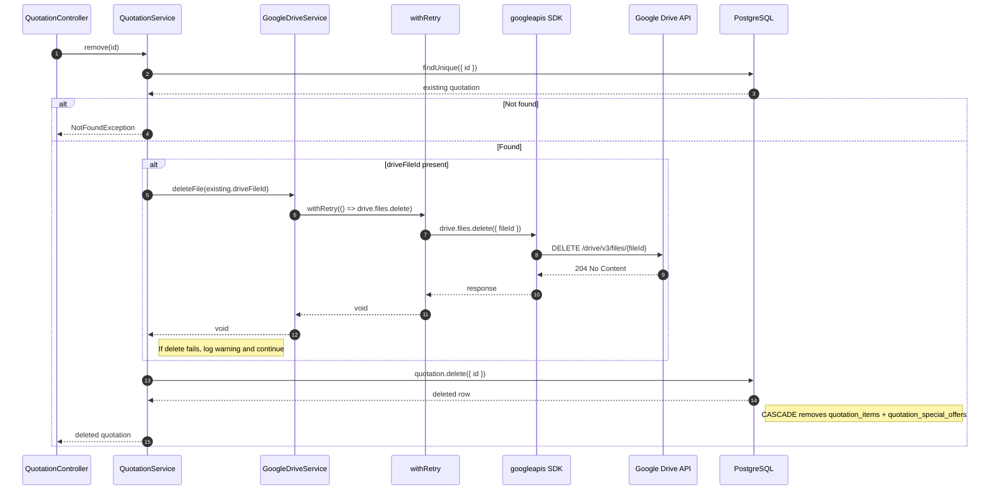

The Drive deletion is wrapped in a `try/catch` that logs a warning but does **not** block the database deletion. This is a deliberate choice: if the Drive file is already gone (e.g. manually trashed), the quotation should still be deleted from the application.

### 4.4.5 Folder Management

| Operation | Endpoint | Service Method | Notes |
|-----------|----------|----------------|-------|
| Validate folder ID | `GET /api/google-drive-settings/validate-folder` | `validateFolder(folderId)` | Calls `drive.files.get` and checks `mimeType === 'application/vnd.google-apps.folder'` |
| Test connection | `GET /api/google-drive-settings/test-connection` | `testConnection()` | Calls `drive.about.get` returning the authenticated user's email |
| Persist folder URL/ID | `PUT /api/google-drive-settings` | `GoogleDriveSettingsService.upsert` | Singleton record in `google_drive_settings` table |

### 4.4.6 Connection Testing

`testConnection()` (`google-drive.service.ts:229-244`) issues a low-cost `drive.about.get({ fields: 'user' })` call. A successful response confirms:

1. The OAuth2 client is correctly configured
2. The refresh token is valid and not expired
3. Network connectivity to Google's API is functioning

The endpoint returns `{ connected: true }` on success or `{ connected: false, error: '<message>' }` on failure. The error message is sourced from the Google API response body if available.

## 4.5 File Lifecycle

The complete lifecycle of a Drive-hosted quotation PDF spans five phases:

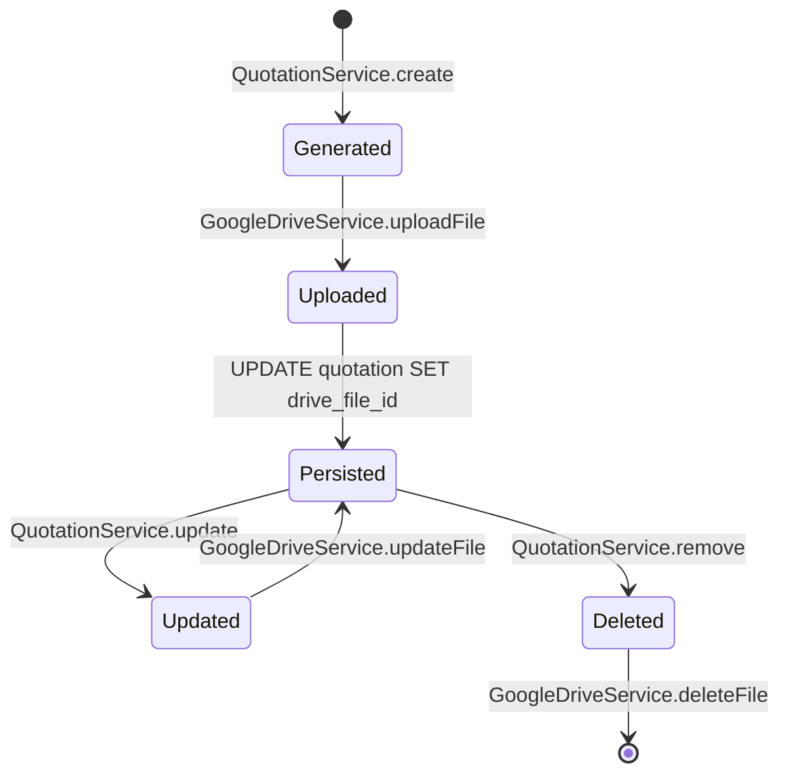

### 4.5.1 PDF Generation

- **Trigger:** `POST /api/quotations` (create) or `PUT /api/quotations/:id` (update)
- **Implementation:** `QuotationService.generateAndUploadPdf()` (`quotation.service.ts:270-295`)
- **Output:** In-memory `Buffer`; no filesystem write

### 4.5.2 Upload to Drive

- **Trigger:** Immediately after PDF generation in `generateAndUploadPdf()`
- **Implementation:** `GoogleDriveService.uploadFile(fileName, buffer, mimeType)`
- **Filename convention:** `${quotationNumber}.pdf` (e.g. `QUO202606001.pdf`)
- **MIME type:** `application/pdf`
- **Result:** `{ fileId, webViewLink, size }`

### 4.5.3 Save Metadata

- **Implementation:** `prisma.quotation.update({ data: { driveFileId, driveUrl, pdfFileSize } })`
- **Location:** `quotation.service.ts:424-439` (create) and `:541-556` (update)
- **Behaviour on failure:** All three fields are set to `null`; the `pdfGenerated` and `driveUploaded` flags in the API response are `false` so the frontend can surface the failure

### 4.5.4 Update Existing Files

When a quotation is edited and a `driveFileId` already exists:

- `QuotationService.updateDrivePdf()` (`quotation.service.ts:297-338`) calls `updateFile()` instead of `uploadFile()`
- Drive replaces the binary content in place; the `fileId` and `webViewLink` remain stable
- If `driveFileId` is `null` (e.g. previous upload failed), the service falls back to `uploadFile()`

### 4.5.5 Delete Obsolete Files

- **Trigger:** `DELETE /api/quotations/:id`
- **Implementation:** `QuotationService.remove()` (`quotation.service.ts:648-664`)
- **Failure handling:** A failed Drive deletion is logged but does not abort the database deletion; the quotation row, its items, and its offers are removed via Prisma cascade

## 4.6 Error Handling

### 4.6.1 Retry Logic

The `withRetry()` higher-order function (`google-drive.service.ts:57-87`) implements a uniform retry policy across upload, update, and delete operations.

| Parameter | Value | Source |
|-----------|-------|--------|
| `MAX_RETRIES` | 3 attempts | `google-drive.service.ts:12` |
| `RETRY_DELAYS` | `[1000ms, 3000ms, 5000ms]` | `google-drive.service.ts:13` |
| Retryable status codes | `403`, `429`, `500`, `503` | `google-drive.service.ts:75` |
| Non-retryable codes | `400`, `404`, `409`, other `4xx` | Thrown immediately |

**Backoff strategy:** Linear with delays of 1s, 3s, 5s between attempts. Exponential backoff was considered and rejected in favour of predictable retry timing suitable for a request-thread operation.

### 4.6.2 Token Expiration Handling

A 401 response triggers exactly one refresh attempt:

```typescript
if (status === 401 && attempt === 0) {
  this.logger.warn(`Auth error during ${operation}, refreshing token...`);
  try {
    await this.oauth2Client.getAccessToken();
    continue;
  } catch {
    throw new Error(`Google Drive auth refresh failed: ${message}`);
  }
}
```

(Source: `google-drive.service.ts:65-73`)

If the refresh succeeds, the original operation is retried. If the refresh itself fails (e.g. refresh token revoked), the error is thrown and propagates to the caller.

### 4.6.3 API Error Handling

Google API errors follow a consistent shape: `error.response.data.error.message`. The retry wrapper extracts this message for logging:

```typescript
const message = error?.response?.data?.error?.message
            || error.message
            || 'Unknown error';
```

(Source: `google-drive.service.ts:63`)

Application-level callers (`QuotationService`) catch Drive errors and degrade gracefully:

- `generateAndUploadPdf` catches and returns `{ driveFileId: null, driveUrl: null, pdfFileSize: null }` (`quotation.service.ts:291-294`)
- `updateDrivePdf` catches and returns the **previous** metadata, preserving the existing Drive link (`quotation.service.ts:330-337`)
- `remove` catches, logs a warning, and proceeds with database deletion (`quotation.service.ts:656-660`)

### 4.6.4 Recovery Process

| Failure Scenario | Recovery Path |
|------------------|----------------|
| Transient 5xx from Drive | Automatic retry within `withRetry()` |
| Rate limit (429) | Automatic retry with 1s/3s/5s backoff |
| Expired access token | Automatic refresh + retry on next attempt |
| Revoked refresh token | Manual: re-run OAuth provisioning flow, update env var, restart backend |
| Invalid folder ID | `validateFolder()` surfaces the error; administrator updates `GOOGLE_DRIVE_FOLDER_ID` |
| File already deleted from Drive | `deleteFile()` failure is logged; database deletion continues |
| Network partition | Retries until exhausted; caller degrades gracefully |

## 4.7 Security Considerations

### 4.7.1 Credential Storage

| Credential | Storage Location | Exposure |
|------------|------------------|----------|
| `GOOGLE_DRIVE_CLIENT_ID` | Environment variable (Render dashboard) | Visible to backend process only |
| `GOOGLE_DRIVE_CLIENT_SECRET` | Environment variable (Render dashboard) | Visible to backend process only |
| `GOOGLE_DRIVE_REFRESH_TOKEN` | Environment variable (Render dashboard) | Visible to backend process only |
| `GOOGLE_DRIVE_FOLDER_ID` | Environment variable (Render dashboard) | Visible to backend process only |

> **Warning:** The repository's `backend/.env` file currently contains real production credentials. This file is in `.gitignore` and must not be committed. If it has been committed at any point, all four credentials must be rotated immediately in the Google Cloud Console.

### 4.7.2 Secret Management

- **Local development:** Credentials stored in `backend/.env` (git-ignored). The `.env.example` file documents the variable names with empty values.
- **Production:** Credentials stored as Render environment variables with `sync: false` (manual entry, not synced from repository) per `render.yaml:19-26`.
- **Rotation:** The refresh token can be revoked at any time from the Google Account security page. After revocation, a new token must be obtained via the offline OAuth flow.
- **Audit:** Google Cloud Console → APIs & Services → Dashboard shows per-client request volume and error rates.

### 4.7.3 Access Control

| Layer | Mechanism |
|-------|-----------|
| Drive folder | Restricted by the OAuth scope (`drive.file` → only files created by this client) |
| Backend endpoints | `JwtAuthGuard` on all Drive-management endpoints (`/api/google-drive-settings/*`) |
| Frontend UI | Settings page accessible to authenticated users; consider gating to `ADMIN` role via `@Roles('ADMIN')` decorator |
| Token transport | HTTPS between browser and backend; HTTPS between backend and Google API |
| Token in memory | Access token cached inside `OAuth2Client`; never logged or returned to client |

### 4.7.4 Risks and Mitigation

| Risk | Likelihood | Impact | Mitigation |
|------|------------|--------|------------|
| Refresh token leaked via `.env` commit | Medium | Critical (full Drive access within scope) | Rotate immediately; use `gitleaks` pre-commit hook |
| Refresh token expiry (90-day idle for some scopes) | Low | Service outage | Monitor `testConnection` endpoint; alert on failure |
| Quotation PDF contains sensitive customer PII | High (by design) | Compliance exposure under PDPA/Thai data law | Restrict Drive folder sharing to internal users; enable Drive audit logs |
| Drive API quota exhaustion | Low | Upload failures | Retry layer absorbs transient limits; monitor Cloud Console quota |
| Malicious filename injection | Low | Drive API rejection or file overwrite | Filenames derived from validated `quotationNumber` matching `^QUO\d{4}(0[1-9]|1[0-2])\d{3}$`; no user-controlled free text in filename |
| Folder ID tampering via `google_drive_settings` table | Low | Files uploaded to wrong folder | Upload folder is sourced from `GOOGLE_DRIVE_FOLDER_ID` env var, not the DB column; DB column is informational only |

---

# 5. Database Documentation

## 5.1 Database Overview

### 5.1.1 Database Type

The system uses **PostgreSQL 16 or later**, accessed exclusively through **Prisma ORM 7.8** via the `@prisma/adapter-pg` driver adapter wrapping `pg.Pool`.

### 5.1.2 ORM Architecture

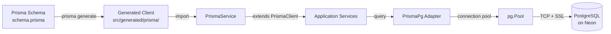

The schema (`backend/prisma/schema.prisma`) is the source of truth. Running `prisma generate` produces a TypeScript client into `backend/src/generated/prisma/` (per the `generator.client.output` directive). The `PrismaService` (`backend/src/prisma/prisma.service.ts`) extends `PrismaClient` with a `PrismaPg` adapter, which provides connection pooling via `pg.Pool`.

### 5.1.3 Connection Strategy

| Aspect | Configuration |
|--------|---------------|
| Pool size | Default `pg.Pool` (10 connections) |
| SSL | Auto-enabled when `DATABASE_URL` contains `neon.tech` (`prisma.service.ts:14-16`) |
| SSL mode in production | `sslmode=require` (in `DATABASE_URL` query string) |
| Connection lifetime | Tied to NestJS module lifecycle (`OnModuleInit`/`OnModuleDestroy`) |
| Pooling layer | `pg.Pool` (application-side); Neon server-side pooling also available via connection string |
| Module scope | `PrismaModule` is `@Global()` (`prisma.module.ts:4`), so `PrismaService` is injectable everywhere |

## 5.2 Entity Relationship Diagram

The diagram below shows all eight tables and their relationships. Cardinality follows Mermaid's `||--o{` (one-to-many) and `||--||` (one-to-one) notation.

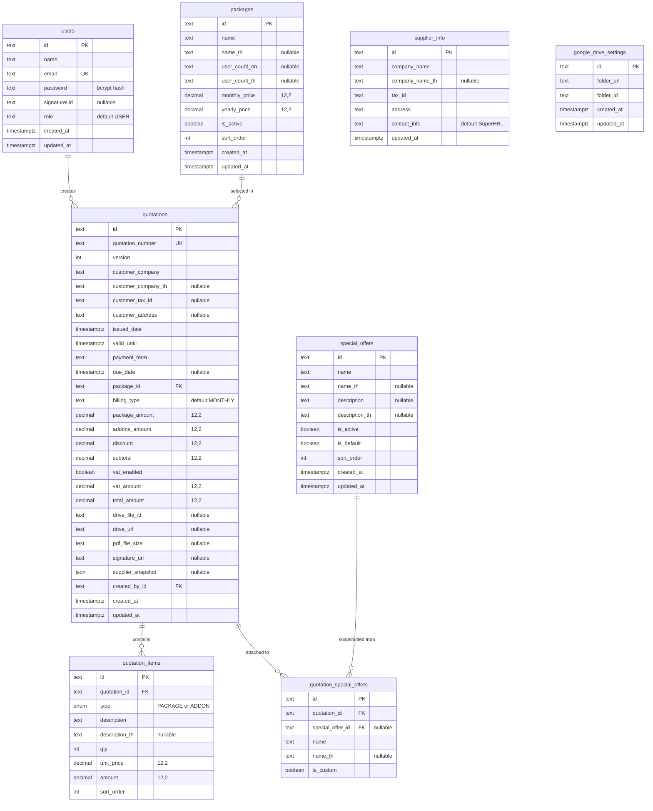

## 5.3 Table Documentation

### 5.3.1 Table: `users`

#### Purpose

Stores application user accounts with authentication credentials and profile data. Each user may create many quotations.

#### Location

- **Prisma model:** `User` (`backend/prisma/schema.prisma:5-16`)
- **Migration:** `20260604033842_init` (initial), `20260608120000_remove_status_and_role_enums` (role column converted from enum to text)

#### Fields

| Column | Prisma Type | SQL Type | Constraints | Description |
|--------|-------------|----------|-------------|-------------|
| `id` | `String @id @default(uuid())` | `TEXT` | Primary key | UUID identifier |
| `name` | `String` | `TEXT` | NOT NULL | Display name |
| `email` | `String @unique` | `TEXT` | NOT NULL, UNIQUE | Login identifier |
| `password` | `String` | `TEXT` | NOT NULL | bcrypt hash (10 rounds) |
| `signatureUrl` | `String?` | `TEXT` | Nullable | URL path to uploaded signature image |
| `role` | `String @default("USER")` | `TEXT` | NOT NULL, default `'USER'` | Authorisation role (`USER` or `ADMIN`) |
| `created_at` | `DateTime @default(now())` | `TIMESTAMP(3)` | NOT NULL | Record creation time |
| `updated_at` | `DateTime @updatedAt` | `TIMESTAMP(3)` | NOT NULL | Last update time (auto-managed) |

> Note: The Prisma `@map` attribute maps camelCase field names to snake_case column names in the database.

#### Relationships

| Relation | Target | Cardinality | FK |
|----------|--------|-------------|----|
| `quotations` | `Quotation` | One-to-Many | `quotations.created_by_id → users.id` |

#### Constraints

- Primary key: `users_pkey (id)`
- Unique: `users_email_key (email)`

#### Indexes

- Implicit unique index on `email` (`users_email_key`)
- No additional indexes (lookups by `id` use the primary key)

#### Business Rules

- Email must be unique across all users (enforced at registration in `auth.service.ts:17-23`)
- Password is hashed with bcrypt at 10 rounds before persistence (`auth.service.ts:25`)
- Role defaults to `USER`; only seed script creates `ADMIN` users (`prisma/seed.ts:26`)
- `signatureUrl` is cleared via `DELETE /api/auth/signature` (`auth.controller.ts:86-92`)

---

### 5.3.2 Table: `supplier_info`

#### Purpose

Singleton record storing the issuing company's information rendered on every quotation PDF. Snapshotted into each quotation at creation time for immutability.

#### Location

- **Prisma model:** `SupplierInfo` (`schema.prisma:43-52`)
- **Migrations:** `20260604033842_init` (initial columns), `20260609010000_supplier_snapshot_and_cleanup` (dropped `phone`, `email`, `website`), `20260609020000_remove_billing_enum_add_user_count` (added `contact_info`)

#### Fields

| Column | Prisma Type | SQL Type | Constraints | Description |
|--------|-------------|----------|-------------|-------------|
| `id` | `String @id @default(uuid())` | `TEXT` | Primary key | UUID identifier |
| `company_name` | `String` | `TEXT` | NOT NULL | English company name |
| `company_name_th` | `String?` | `TEXT` | Nullable | Thai company name |
| `tax_id` | `String` | `TEXT` | NOT NULL | Thai tax ID (13 digits) |
| `address` | `String` | `TEXT` | NOT NULL | Company address |
| `contact_info` | `String @default(...)` | `TEXT` | NOT NULL | Single-line contact string for PDF footer |
| `updated_at` | `DateTime @updatedAt` | `TIMESTAMP(3)` | NOT NULL | Last update time |

#### Relationships

None. The `supplier_info` table has no foreign keys. It is consumed by `QuotationService` which captures a JSON snapshot into `quotations.supplier_snapshot`.

#### Constraints

- Primary key: `supplier_info_pkey (id)`

#### Indexes

None.

#### Business Rules

- **Singleton pattern:** The application reads only the first row (`supplier.service.ts:9-15`) and upserts against it (`supplier.service.ts:17-28`). The seed script creates a row with `id = 'supplier-info-singleton'` (`prisma/seed.ts:31-44`).
- The `contact_info` field carries the pipe-delimited footer line rendered at the bottom of every PDF page (`quotation-pdf.tsx:617-619`).
- Editing supplier info does **not** retroactively change existing quotations because they hold a snapshot.

---

### 5.3.3 Table: `packages`

#### Purpose

Master list of pricing packages offered to customers. Each quotation references exactly one package.

#### Location

- **Prisma model:** `Package` (`schema.prisma:54-69`)
- **Migrations:** `20260604033842_init`, `20260609020000_remove_billing_enum_add_user_count` (added `user_count_en`/`user_count_th`, dropped `billing_type`, `description`, `description_th`)

#### Fields

| Column | Prisma Type | SQL Type | Constraints | Description |
|--------|-------------|----------|-------------|-------------|
| `id` | `String @id @default(uuid())` | `TEXT` | Primary key | UUID identifier |
| `name` | `String` | `TEXT` | NOT NULL | English package name |
| `name_th` | `String?` | `TEXT` | Nullable | Thai package name |
| `user_count_en` | `String?` | `TEXT` | Nullable | English user-count label (e.g. "Unlimited Users") |
| `user_count_th` | `String?` | `TEXT` | Nullable | Thai user-count label |
| `monthly_price` | `Decimal @db.Decimal(12,2)` | `DECIMAL(12,2)` | NOT NULL, default 0 | Monthly billing price in THB |
| `yearly_price` | `Decimal @db.Decimal(12,2)` | `DECIMAL(12,2)` | NOT NULL, default 0 | Yearly billing price in THB |
| `is_active` | `Boolean @default(true)` | `BOOLEAN` | NOT NULL | Soft visibility flag for create form |
| `sort_order` | `Int @default(0)` | `INTEGER` | NOT NULL | Display order (ascending) |
| `created_at` | `DateTime @default(now())` | `TIMESTAMP(3)` | NOT NULL | Record creation time |
| `updated_at` | `DateTime @updatedAt` | `TIMESTAMP(3)` | NOT NULL | Last update time |

#### Relationships

| Relation | Target | Cardinality | FK |
|----------|--------|-------------|----|
| `quotations` | `Quotation` | One-to-Many | `quotations.package_id → packages.id` |

#### Constraints

- Primary key: `packages_pkey (id)`
- Foreign key constraint on `quotations.package_id` with `ON DELETE RESTRICT` (cannot delete a package referenced by any quotation)

#### Indexes

None beyond the primary key.

#### Business Rules

- The create form only displays packages with `is_active = true` (`quotations/create/page.tsx:650-652`).
- Package list is sorted by `sort_order` ascending (`package.service.ts:11-13`).
- Deleting a package referenced by a quotation fails at the database level due to the RESTRICT constraint; UI should pre-warn administrators.
- The seed script creates four packages with stable IDs (`pkg-starter`, `pkg-basic-account`, `pkg-advanced`, `pkg-go-pro`) to allow upserts (`prisma/seed.ts:47-88`).

---

### 5.3.4 Table: `special_offers`

#### Purpose

Master list of promotional offers that can be attached to quotations. Attachment creates a snapshot row in `quotation_special_offers`.

#### Location

- **Prisma model:** `SpecialOffer` (`schema.prisma:71-83`)
- **Migration:** `20260604033842_init`

#### Fields

| Column | Prisma Type | SQL Type | Constraints | Description |
|--------|-------------|----------|-------------|-------------|
| `id` | `String @id @default(uuid())` | `TEXT` | Primary key | UUID identifier |
| `name` | `String` | `TEXT` | NOT NULL | English offer name |
| `name_th` | `String?` | `TEXT` | Nullable | Thai offer name |
| `description` | `String?` | `TEXT` | Nullable | English description |
| `description_th` | `String?` | `TEXT` | Nullable | Thai description |
| `is_active` | `Boolean @default(true)` | `BOOLEAN` | NOT NULL | Visibility flag |
| `is_default` | `Boolean @default(false)` | `BOOLEAN` | NOT NULL | Auto-select on new quotations |
| `sort_order` | `Int @default(0)` | `INTEGER` | NOT NULL | Display order |
| `created_at` | `DateTime @default(now())` | `TIMESTAMP(3)` | NOT NULL | Record creation time |
| `updated_at` | `DateTime @updatedAt` | `TIMESTAMP(3)` | NOT NULL | Last update time |

#### Relationships

| Relation | Target | Cardinality | FK |
|----------|--------|-------------|----|
| `quotationOffers` | `QuotationSpecialOffer` | One-to-Many | `quotation_special_offers.special_offer_id → special_offers.id` |

#### Constraints

- Primary key: `special_offers_pkey (id)`
- Foreign key on `quotation_special_offers.special_offer_id` with `ON DELETE SET NULL` (deleting an offer nulls the snapshot row's `special_offer_id` but preserves the snapshotted `name`/`name_th`)

#### Indexes

None beyond the primary key.

#### Business Rules

- Offers with `is_active = false` are hidden from the create form.
- Offers with `is_default = true` are pre-selected when initialising a new quotation form (`quotations/create/page.tsx:166-171`).
- The create form allows inline creation and editing of offers via the `SpecialOfferFormDialog` component.

---

### 5.3.5 Table: `quotations`

#### Purpose

The central business entity — a single quotation document issued to a customer. Stores customer information, package selection, financial totals, Drive metadata, and an immutable supplier snapshot.

#### Location

- **Prisma model:** `Quotation` (`schema.prisma:85-122`)
- **Migrations:** All six migrations touch this table; the cumulative shape is documented here.

#### Fields

| Column | Prisma Type | SQL Type | Constraints | Description |
|--------|-------------|----------|-------------|-------------|
| `id` | `String @id @default(uuid())` | `TEXT` | Primary key | UUID identifier |
| `quotation_number` | `String @unique` | `TEXT` | NOT NULL, UNIQUE | Format `QUOYYYYMMNNN` |
| `version` | `Int @default(1)` | `INTEGER` | NOT NULL | Revision counter, incremented on each update (`quotation.service.ts:491`) |
| `customer_company` | `String` | `TEXT` | NOT NULL | English customer company name |
| `customer_company_th` | `String?` | `TEXT` | Nullable | Thai customer company name |
| `customer_tax_id` | `String?` | `TEXT` | Nullable | Customer tax ID (13 digits, validated) |
| `customer_address` | `String?` | `TEXT` | Nullable | Customer address |
| `issued_date` | `DateTime` | `TIMESTAMP(3)` | NOT NULL | Quotation issue date |
| `valid_until` | `DateTime` | `TIMESTAMP(3)` | NOT NULL | Quotation expiry date |
| `payment_term` | `String @default("1 Month")` | `TEXT` | NOT NULL | Human-readable payment term |
| `due_date` | `DateTime?` | `TIMESTAMPTZ` | Nullable | Calculated due date for PDF banner |
| `package_id` | `String` | `TEXT` | NOT NULL, FK | Selected package |
| `billing_type` | `String @default("MONTHLY")` | `TEXT` | NOT NULL | `MONTHLY` or `YEARLY` |
| `package_amount` | `Decimal @db.Decimal(12,2)` | `DECIMAL(12,2)` | NOT NULL, default 0 | Sum of PACKAGE items |
| `addons_amount` | `Decimal @db.Decimal(12,2)` | `DECIMAL(12,2)` | NOT NULL, default 0 | Sum of ADDON items |
| `discount` | `Decimal @db.Decimal(12,2)` | `DECIMAL(12,2)` | NOT NULL, default 0 | Discount applied to subtotal |
| `subtotal` | `Decimal @db.Decimal(12,2)` | `DECIMAL(12,2)` | NOT NULL, default 0 | `packageAmount + addonsAmount - discount` |
| `vat_enabled` | `Boolean @default(false)` | `BOOLEAN` | NOT NULL | Whether VAT 7% is applied |
| `vat_amount` | `Decimal @db.Decimal(12,2)` | `DECIMAL(12,2)` | NOT NULL, default 0 | `vatEnabled ? subtotal * 0.07 : 0` |
| `total_amount` | `Decimal @db.Decimal(12,2)` | `DECIMAL(12,2)` | NOT NULL, default 0 | `subtotal + vatAmount` |
| `drive_file_id` | `String?` | `TEXT` | Nullable | Google Drive file ID |
| `drive_url` | `String?` | `TEXT` | Nullable | Google Drive web view link |
| `pdf_file_size` | `String?` | `TEXT` | Nullable | File size in bytes (Drive-reported) |
| `signature_url` | `String?` | `TEXT` | Nullable | Signature image URL at creation time |
| `supplier_snapshot` | `Json?` | `JSONB` | Nullable | Frozen supplier info for PDF reproducibility |
| `created_by_id` | `String` | `TEXT` | NOT NULL, FK | Author |
| `created_at` | `DateTime @default(now())` | `TIMESTAMP(3)` | NOT NULL | Record creation time |
| `updated_at` | `DateTime @updatedAt` | `TIMESTAMP(3)` | NOT NULL | Last update time |

#### Relationships

| Relation | Target | Cardinality | FK | On Delete |
|----------|--------|-------------|----|-----------|
| `createdBy` | `User` | Many-to-One | `created_by_id → users.id` | RESTRICT |
| `package` | `Package` | Many-to-One | `package_id → packages.id` | RESTRICT |
| `items` | `QuotationItem` | One-to-Many | reverse of `quotation_items.quotation_id` | CASCADE |
| `offerRecords` | `QuotationSpecialOffer` | One-to-Many | reverse of `quotation_special_offers.quotation_id` | CASCADE |

#### Constraints

- Primary key: `quotations_pkey (id)`
- Unique: `quotations_quotation_number_key (quotation_number)`
- Foreign key: `quotations_created_by_id_fkey` (`ON DELETE RESTRICT`)
- Foreign key: `quotations_package_id_fkey` (`ON DELETE RESTRICT`)

#### Indexes

- Implicit unique index on `quotation_number`
- No B-tree index on `customer_company` despite search-by-substring queries (relies on sequential scan at current scale)
- No index on `issued_date` despite date-range filters

> **Recommendation:** Add indexes on `(customer_company)` and `(issued_date)` if the table grows beyond ~10k rows.

#### Business Rules

1. **Quotation number uniqueness** is enforced both at the database (unique constraint) and at the application layer (`validateQuotationNumber()` in `quotation.service.ts:118-173`).
2. **Server-side recalculation** of all financial fields overrides any client-supplied values (`quotation.service.ts:41-82`).
3. **Supplier snapshot** is refreshed on every create and update operation (`quotation.service.ts:355-363` and `:461-469`), ensuring the PDF can be regenerated deterministically.
4. **Version increment** on every update (`quotation.service.ts:491`).
5. **Drive file lifecycle** is bound to quotation create/update/delete (see §4.5).
6. **Due date** is optional; when present, the PDF banner renders it in Thai Buddhist Era format (`quotation-pdf.tsx:480`).

---

### 5.3.6 Table: `quotation_items`

#### Purpose

Line items belonging to a single quotation. Each item is either `PACKAGE` (the primary subscription) or `ADDON` (additional purchase).

#### Location

- **Prisma model:** `QuotationItem` (`schema.prisma:124-135`)
- **Migration:** `20260604033842_init`

#### Fields

| Column | Prisma Type | SQL Type | Constraints | Description |
|--------|-------------|----------|-------------|-------------|
| `id` | `String @id @default(uuid())` | `TEXT` | Primary key | UUID identifier |
| `quotation_id` | `String` | `TEXT` | NOT NULL, FK | Parent quotation |
| `type` | `QuotationItemType` | `ENUM('PACKAGE','ADDON')` | NOT NULL, default `PACKAGE` | Item classification |
| `description` | `String` | `TEXT` | NOT NULL | English description |
| `description_th` | `String?` | `TEXT` | Nullable | Thai description |
| `qty` | `Int @default(1)` | `INTEGER` | NOT NULL, default 1 | Quantity |
| `unit_price` | `Decimal @db.Decimal(12,2)` | `DECIMAL(12,2)` | NOT NULL, default 0 | Per-unit price in THB |
| `amount` | `Decimal @db.Decimal(12,2)` | `DECIMAL(12,2)` | NOT NULL, default 0 | `qty * unit_price` |
| `sort_order` | `Int @default(0)` | `INTEGER` | NOT NULL | Display order |

#### Relationships

| Relation | Target | Cardinality | FK | On Delete |
|----------|--------|-------------|----|-----------|
| `quotation` | `Quotation` | Many-to-One | `quotation_id → quotations.id` | CASCADE |

#### Constraints

- Primary key: `quotation_items_pkey (id)`
- Foreign key: `quotation_items_quotation_id_fkey` (`ON DELETE CASCADE`)

#### Indexes

None beyond the primary key.

> **Recommendation:** Add an index on `quotation_id` to accelerate `include` queries. Currently Prisma's include relies on a sequential scan.

#### Business Rules

- Exactly one item per quotation should have `type = PACKAGE` (enforced by application logic in the create form, not by database constraint).
- Updating a quotation replaces all items: `deleteMany: {}` followed by `create: [...]` (`quotation.service.ts:498-511`).
- The `amount` field is recomputed server-side as `qty * unitPrice` (`quotation.service.ts:76-79`).

---

### 5.3.7 Table: `quotation_special_offers`

#### Purpose

Snapshot rows capturing which offers were attached to a quotation at creation/update time. The `special_offer_id` is nullable so that deleting the source offer preserves the snapshot.

#### Location

- **Prisma model:** `QuotationSpecialOffer` (`schema.prisma:137-149`)
- **Migration:** `20260604033842_init`

#### Fields

| Column | Prisma Type | SQL Type | Constraints | Description |
|--------|-------------|----------|-------------|-------------|
| `id` | `String @id @default(uuid())` | `TEXT` | Primary key | UUID identifier |
| `quotation_id` | `String` | `TEXT` | NOT NULL, FK | Parent quotation |
| `special_offer_id` | `String?` | `TEXT` | Nullable, FK | Source offer (nullable for snapshot integrity) |
| `name` | `String` | `TEXT` | NOT NULL | Snapshotted English name |
| `name_th` | `String?` | `TEXT` | Nullable | Snapshotted Thai name |
| `is_custom` | `Boolean @default(false)` | `BOOLEAN` | NOT NULL | Flag for ad-hoc offers not in catalogue |

#### Relationships

| Relation | Target | Cardinality | FK | On Delete |
|----------|--------|-------------|----|-----------|
| `quotation` | `Quotation` | Many-to-One | `quotation_id → quotations.id` | CASCADE |
| `specialOffer` | `SpecialOffer` | Many-to-One | `special_offer_id → special_offers.id` | SET NULL |

#### Constraints

- Primary key: `quotation_special_offers_pkey (id)`
- Foreign key: `quotation_special_offers_quotation_id_fkey` (`ON DELETE CASCADE`)
- Foreign key: `quotation_special_offers_special_offer_id_fkey` (`ON DELETE SET NULL`)

#### Indexes

None beyond the primary key.

#### Business Rules

- Updating a quotation replaces all offer records: `deleteMany: {}` followed by `create: [...]` (`quotation.service.ts:513-523`).
- The `name`/`name_th` columns are populated from the source offer at insert time, providing immutability even if the source offer is renamed or deleted.
- The `isCustom` flag is reserved for ad-hoc offers created inline on a quotation; currently the frontend always sets this to `false` (`quotations/create/page.tsx:406`).

---

### 5.3.8 Table: `google_drive_settings`

#### Purpose

Singleton record storing a runtime-configurable Google Drive folder URL and ID. Used by the Drive settings UI for connection testing; the active upload folder is sourced from the `GOOGLE_DRIVE_FOLDER_ID` env var.

#### Location

- **Prisma model:** `GoogleDriveSettings` (`schema.prisma:38-46`)
- **Migration:** `20260608013434_add_google_drive_settings`

#### Fields

| Column | Prisma Type | SQL Type | Constraints | Description |
|--------|-------------|----------|-------------|-------------|
| `id` | `String @id @default(uuid())` | `TEXT` | Primary key | UUID identifier |
| `folder_url` | `String` | `TEXT` | NOT NULL | Drive folder share URL |
| `folder_id` | `TEXT` | `TEXT` | NOT NULL | Drive folder ID |
| `created_at` | `DateTime @default(now())` | `TIMESTAMP(3)` | NOT NULL | Record creation time |
| `updated_at` | `DateTime @updatedAt` | `TIMESTAMP(3)` | NOT NULL | Last update time |

#### Relationships

None.

#### Constraints

- Primary key: `google_drive_settings_pkey (id)`

#### Indexes

None.

#### Business Rules

- Singleton pattern enforced by application code (`google-drive-settings.service.ts:9-15` reads only the first row; `:17-28` upserts against it).
- The persisted `folder_id` is **not** used as the upload destination; uploads always use `process.env.GOOGLE_DRIVE_FOLDER_ID`.

## 5.4 Data Lifecycle

### 5.4.1 Creation Flow

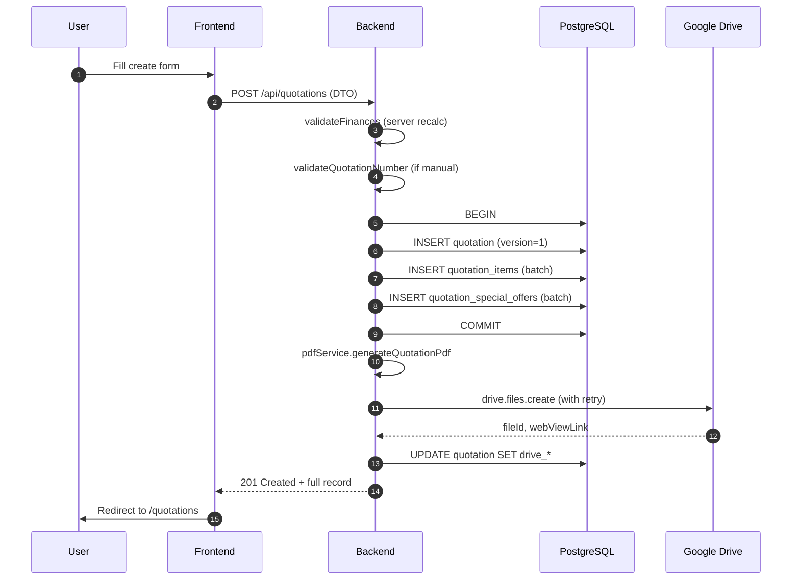

### 5.4.2 Update Flow

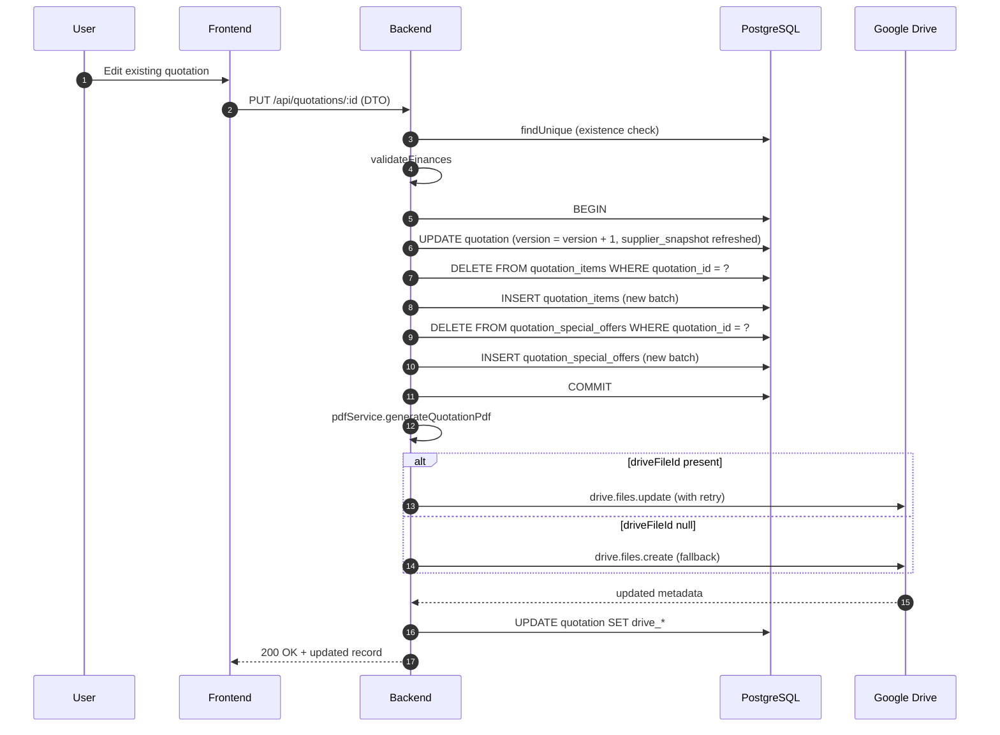

### 5.4.3 Deletion Flow

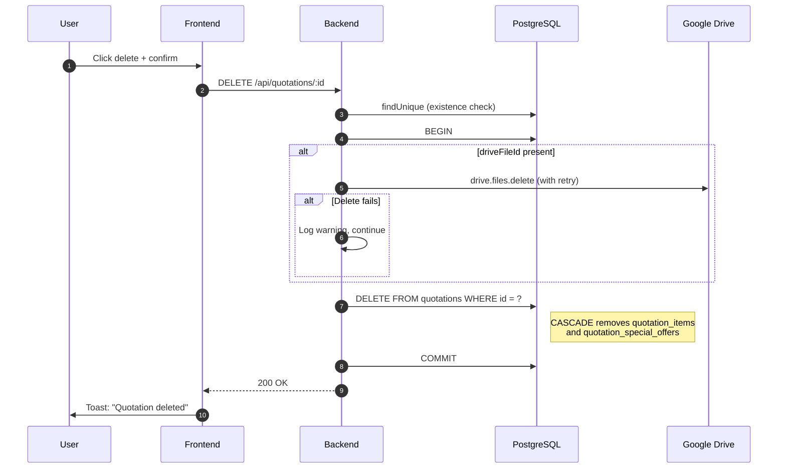

### 5.4.4 Soft Delete vs Hard Delete

The system uses **hard delete only**. There is no `deleted_at` column on any table, and no Prisma middleware implements soft-delete semantics. Once a quotation is deleted, the row and all cascade children are permanently removed from the database.

**Implication:** Audit requirements may necessitate adding a soft-delete column or a separate audit-log table in future iterations.

## 5.5 Migration Strategy

### 5.5.1 Prisma Migrations

Migrations live in `backend/prisma/migrations/` and follow the standard Prisma migration format. Each migration directory contains a `migration.sql` file and is timestamped with `YYYYMMDDHHMMSS_description`.

| Migration | Date | Summary | Risk |
|-----------|------|---------|------|
| `20260604033842_init` | 2026-06-04 | Initial schema; all tables + four enums (`UserRole`, `BillingType`, `QuotationStatus`, `QuotationItemType`) | Baseline |
| `20260608013434_add_google_drive_settings` | 2026-06-08 | Adds `google_drive_settings` table | Low — additive |
| `20260608120000_remove_status_and_role_enums` | 2026-06-08 | Drops `QuotationStatus` enum + `quotations.status` column; converts `users.role` from enum to `TEXT` | Medium — data loss (status column dropped) |
| `20260609010000_supplier_snapshot_and_cleanup` | 2026-06-09 | Drops `phone`, `email`, `website` from `supplier_info`; adds `supplier_snapshot` JSONB to `quotations`; backfills existing rows | Medium — backfill subquery assumes single-row supplier |
| `20260609020000_remove_billing_enum_add_user_count` | 2026-06-09 | Drops `BillingType` enum; converts `quotations.billing_type` to TEXT; drops `description`/`description_th` from packages; adds `user_count_en`/`user_count_th`/`contact_info`; backfills | Medium — multiple enum-to-text conversions |
| `20260609074219_add_payment_term` | 2026-06-09 | Adds `payment_term` (TEXT) and `due_date` (TIMESTAMPTZ) to `quotations` | Low — additive |

### 5.5.2 Deployment Migrations

The `render.yaml` start command runs migrations before the application boots:

```yaml
startCommand: npx prisma migrate deploy && node dist/main.js
```

This ensures the database schema is always up-to-date on every deploy. `prisma migrate deploy` applies pending migrations in order and refuses to run if a migration has been edited (checksum verification).

### 5.5.3 Rollback Considerations

Prisma does not natively support rollback migrations. The team's rollback strategy is:

1. **Forward-only philosophy** — A bad migration is fixed by writing a new corrective migration, not by reverting.
2. **Database-level PITR** — Neon provides point-in-time recovery; consult Neon documentation for retention window (typically 7–30 days depending on plan).
3. **Pre-deploy validation** — All migrations should be tested against a staging database before production deploy.
4. **Backwards-compatible migrations preferred** — Additive migrations (new column, new table) are always safe; destructive migrations (column drop, type change) require careful sequencing:
   - Phase 1: Deploy code that reads old + new shape
   - Phase 2: Run migration
   - Phase 3: Deploy code that uses only new shape

> **Caution:** Migrations `20260608120000` and `20260609020000` are destructive (column drops, enum drops). If rollback to a pre-migration schema were required, the application code would also need to be rolled back to a compatible commit.

### 5.5.4 Seed Script

`backend/prisma/seed.ts` is executed via `npx tsx prisma/seed.ts` (configured in `prisma.config.ts:8`). The script is **idempotent** — it uses `upsert` for every record and is safe to run multiple times. It seeds:

- One `ADMIN` user (`admin@superhr.com` / `admin123`)
- One supplier record (`supplier-info-singleton`)
- Four packages (`pkg-starter`, `pkg-basic-account`, `pkg-advanced`, `pkg-go-pro`)
- Three special offers (`offer-free-data-migration`, `offer-24-7-technical-support`, `offer-unlimited-users`)

> **Security note:** The seeded admin password (`admin123`) is for initial bootstrap only. The first administrative action after deployment must be to change this password via `PUT /api/auth/password`.

## 5.6 Database Security

### 5.6.1 Authentication

| Layer | Mechanism |
|-------|-----------|
| Application ↔ Database | Connection string in `DATABASE_URL` contains username + password |
| Database user | Neondb owner account (per `.env`) |
| Connection encryption | SSL required (`sslmode=require` in production connection string) |
| SSL certificate verification | Relaxed for Neon (`rejectUnauthorized: false` in `prisma.service.ts:14-16`) |

> **Recommendation:** Use a dedicated least-privilege database user for the application instead of the Neondb owner account.

### 5.6.2 Authorisation

Database-level authorisation is **not** enforced. All application users share the same database connection; row-level access control is enforced at the application layer by:

- **JWT authentication** on every protected endpoint via `JwtAuthGuard`
- **Role checks** via `RolesGuard` when `@Roles(...)` decorator is present (currently no endpoint uses this decorator, so role enforcement is not active)

> **Recommendation:** Apply `@Roles('ADMIN')` to supplier, package, special-offer, and Drive-settings endpoints to restrict administrative actions.

### 5.6.3 Data Protection

| Concern | Strategy |
|---------|----------|
| Passwords | bcrypt hash at 10 rounds (`auth.service.ts:25`) |
| Customer PII (tax ID, address) | Stored in plaintext; encryption at rest depends on Neon |
| JWT secret | Stored as Render env var; auto-generated on Render for production |
| Backup encryption | Provided by Neon (managed service) |
| In-transit encryption | SSL on all connections (DB and API) |

### 5.6.4 Backup Considerations

| Strategy | Status | Recommendation |
|----------|--------|----------------|
| Neon PITR (point-in-time recovery) | Verify enabled on plan | Essential for recovery from bad migration or accidental deletion |
| Logical dumps (`pg_dump`) | Not configured | Schedule weekly logical exports to a separate region/account |
| Google Drive file backups | Not configured | Drive files inherit Google Workspace backup; consider Drive audit log retention |
| Repository (code) backups | GitHub-hosted | Ensure GitHub repo has documented restore procedure |
| Seed script reproducibility | Idempotent `upsert`s | Allows baseline data to be recreated; transactional data must come from backups |

> **Critical:** Without PITR or scheduled `pg_dump`, a destructive migration or `DELETE` without `WHERE` is unrecoverable. Enabling backups is a hard prerequisite for production launch.

---

*End of Document*
